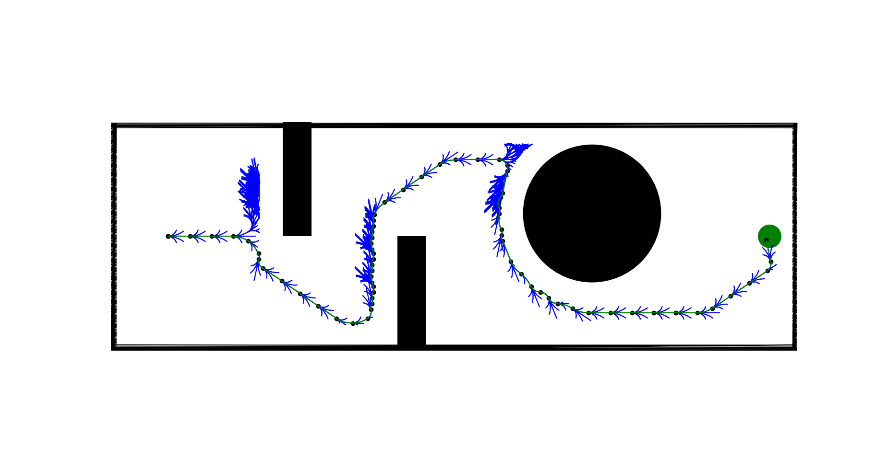

# Project 3

Download and Unizip the files and paste the files in your workspace

```sh
cd <workspace>
colcon build --packages-select turtlebot3_project3
source install/setup.bash
```

## Part 1

```sh
cd src/part1
python3 a-star.py
```

Example input:

```sh
Enter the start x co-ordinate: 50
Enter the start y co-ordinate: 100
Enter the goal x co-ordinate: 575
Enter the goal y co-ordinate: 100
Enter the clearance: 20
enter the threshold: 10
enter the rpm1: 50
enter the rpm2: 70
```

This will generate a path from start to goal using A* algorithm and a csv file with the rpms

## Part 2

```sh
cd ..
# Make sure you are in the workspace also check if the csv file is present in the turtlebot3_project3 scripts folder

ros2 launch turtlebot3_project3 competition_world.launch.py

# Open a new terminal
ros2 run turtlebot3_project3 publish_vel.py
```


